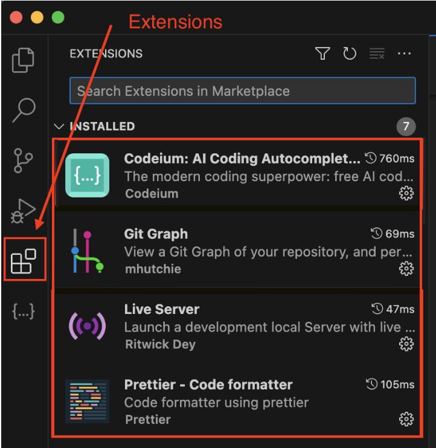

# Webseite mit HTML und CSS
Das Ziel dieses Projektes ist, eine eigene Webseite zu einem von Ihnen gewählten Thema zu erstellen.
Bevor Sie jedoch loslegen können, müssen ein paar Grundinstallationen gemacht werden.

# Installation von VS Code
Visual Studio Code (kurz VS Code) ist ein kostenloser Quelltext-Editor von Microsoft. VS Code ist plattformübergreifend für die Betriebssysteme Windows, macOS und Linux verfügbar. Von nun an werden Sie diesen Editor viel verwenden. Unter anderem, um eine Webseite mit den Sprachen HTML und CSS zu erstellen, Grafiken mit SVG zu konstruieren oder auch um JS zu lernen.
Dafür müssen Sie aber zunächst VS Code installieren:

> [Link für Installation](https://code.visualstudio.com)

Öffnen Sie nach der Installation das Programm. Am linken Rand von VS-Code finden Sie das Menü Extensions. Suchen Sie dort nach den **Extensions** *Codeium, Git Graph, LiveServer* sowie *Prettier* und installieren Sie sie.

Später müssen Sie Ihren Code immer wieder **Speichern**, dies können Sie über `ctrl + S`(Windows) oder `command + S` (macOS) tun. Wenn Sie das **Befehlsfenster** öffnen möchten, so können Sie dies über `shift + ctrl + P` (Windows) oder `shift + command + P` (macOS) tun.

# Projekt mit GitHub
**Git** ist ein Versionskontrollsystem, das Änderungen in Ihren Dateien intelligent nachverfolgt. Git ist besonders nützlich für die Nachverfolgung von Codeänderungen und Kollaborationen. Beispielsweise können Sie und eine Gruppe von Personen gleichzeitig Änderungen ("commits") an denselben Dateien vornehmen.

**GitHub** ist nicht dasselbe wie Git. GitHub ist eine cloud-basierte Plattform, welche Werkzeuge zur Verfügung stellt, um einfach mit Git zu arbeiten. Im Zentrum steht dabei die Arbeit mit sogenannten "Repository". 

Bevor Sie das zur Verfügung gestellte Repository Klonen und bearbeiten können, müssen Sie GitHub Desktop installieren:

> [Link für Installation](https://desktop.github.com/download/)

Erstellen Sie nach der Installation einen Account und notieren Sie sich Ihre Anmeldedaten.

# Weitere einmalige Schritte
- Projekt 01-HTML-CSS klonen und speichern
- VS Code > Git Graph > Personendaten

# Commits erstellen
Wenn Sie Änderungen an `index.html` oder `style.css` vorgenommen haben, so sollten Sie in sinnvollen Abständen *Commits* setzen.

Dadurch wird ihr Prozess festgehalten und es wird nachvollziehbar, wann Sie was geändert oder ergänzt haben. Zudem können Sie jederzeit zu einer älteren Version Ihres Projektes wechseln oder Versionen vergleichen.

Ein Commit kann folgendermassen gemacht werden:
- Navigieren Sie auf der linken Seite in VS Code zu "*Quellcodeverwaltung*".
- Drücken Sie bei "*Änderungen*" oder den einzelnen *Dateien* auf das Plus-Symbol.
- Danach sollten die Dateien unter "*gestagete Änderungen*" aufgelistet sein.
- Notieren Sie eine kurze sinnvolle Nachricht im Eingabefenster.
- Drücken Sie im Anschluss auf "*commit*" und im Anschluss auf den Pfeil.
