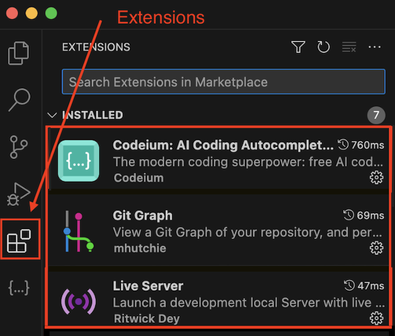

# Webseite mit HTML und CSS
Das Ziel dieses Projektes ist, eine eigene Webseite zu einem von Ihnen gewählten Thema zu erstellen.
Bevor Sie jedoch loslegen können, müssen ein paar Grundinstallationen gemacht werden.

# Installation von VS Code
Visual Studio Code (kurz VS Code) ist ein kostenloser Quelltext-Editor von Microsoft. VS Code ist plattformübergreifend für die Betriebssysteme Windows, macOS und Linux verfügbar. Von nun an werden Sie diesen Editor viel verwenden. Unter anderem, um eine Webseite mit den Sprachen html und CSS zu erstellen, Grafiken mit SVG zu konstruieren oder auch um JS zu lernen.
Dafür müssen Sie aber zunächst VS Code installieren:

> [Link für Installation](https://code.visualstudio.com)

Öffnen Sie nach der Installation das Programm. Am linken Rand von VS-Code finden Sie das Menü Extensions. Suchen Sie dort nach den **Extensions** *Codeium, LiveServer* sowie *Prettier* und installieren Sie sie.

Später müssen Sie Ihren Code immer wieder **Speichern**, dies können Sie über `ctrl + S`(Windows) oder `command + S` (macOS) tun. Wenn Sie das **Befehlsfenster** öffnen möchten,so können Sie dies über `shift + ctrl + P` (Windows) oder `shift + command + P` (macOS) tun.

# Projekt mit GitHub
**GitHub** ist eine cloud-basierte Plattform, auf der Sie Code speichern, teilen und mit anderen zusammenarbeiten können. Indem Sie Code in einem «Repository» auf GitHub speichern, können Sie: Ihre Arbeit präsentieren oder teilen. Änderungen an Ihrem Code im Laufe der Zeit nachverfolgen und verwalten.

**Git** ist ein Versionskontrollsystem, das Änderungen in Ihren Dateien intelligent nachver- folgt. Git ist besonders nützlich, wenn Sie und eine Gruppe von Personen gleichzeitig Änderungen («commits») an denselben Dateien vornehmen.

Bevor Sie das zur Verfügung gestellte Repository Klonen und bearbeiten können, müssen Sie GitHub Desktop installieren:

> [Link für Installation](https://desktop.github.com/download/)

Erstellen Sie nach der Instrallation einen Account und notieren Sie sich Ihre Anmeldedaten.